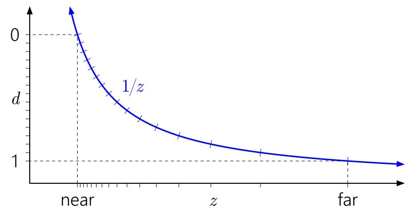

### Why is my depth buffer so faint?

The depth is stored in the range (0.0, 1.0) or (0.0 being closest, 1: farthest) by default. In addition, depth in perspective projection is not linear.

So it would make sense that the buffer is mostly white. Unless, you normalize it; which means to remap the depth buffer values between the min and max values to be between on the range (0.0, 1.0). 